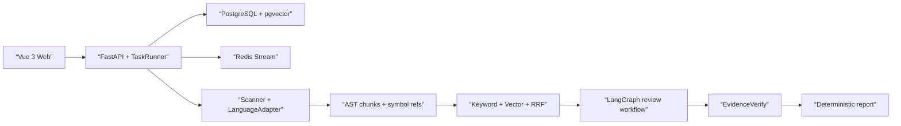
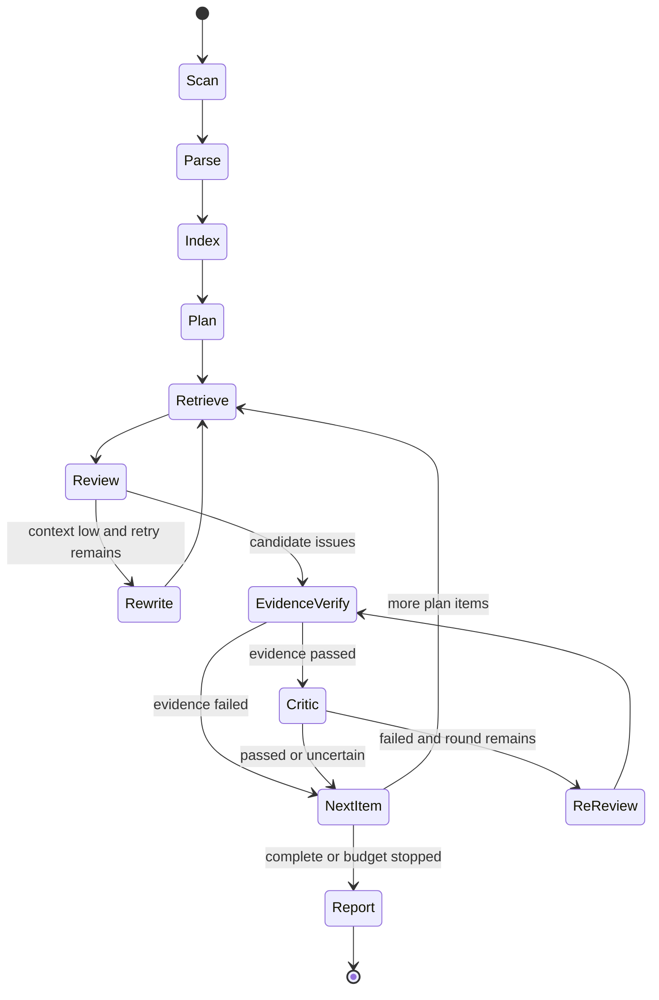

# CodeReview Agent

面向 Java、Python 项目的可解释、可测量 AI 代码审查平台：结论必须回到真实文件、
行号和代码证据。

> **状态**：M01-M11 全部完成，核心链路可运行。支持本地文件夹上传、Hybrid RAG 检索、
> LangGraph Agent 工作流、EvidenceVerify 证据校验和 Markdown 报告生成。

## 问题、边界与非目标

CodeReview Agent 解决”大仓库无法可靠地整包交给模型”和”审查结论缺少可核验证据”
两个问题。系统先解析、分块和检索，再由有预算上限的 Agent 工作流审查，并在输出前
执行确定性证据校验。

P0 不执行、导入或编译上传代码；Agent 不能使用 Shell、任意 SQL 或外部网络；平台
不替代人工审查，也不宣称替代成熟 SAST。

## 架构





所有 LangGraph 路由都是纯函数。任务由进程内 TaskRunner 自动轮询执行（启动后端即可，无需额外 Worker），
任务写入使用幂等键，SSE 以数据库事件 ID 支持断线续传。

## 语言支持

| 能力                 | Java | Python |
| -------------------- | ---: | -----: |
| 文件识别与优先级     |   ✅ |     ✅ |
| Tree-sitter 解析     |   ✅ |     ✅ |
| 符号、行号与引用提取 |   ✅ |     ✅ |
| AST 分块与降级       |   ✅ |     ✅ |
| 内部 Smoke Benchmark | 8 类 |   8 类 |

新增语言时实现 `backend/app/languages/base.py` 中的 `LanguageAdapter`，封装文件识别、
解析、符号与引用差异，再在 `create_default_registry` 注册。检索和 Agent 主流程不应
增加语言分支。

## Hybrid RAG

基础 Chunk 由 AST 生成并保存路径、符号、行号和哈希。索引分别使用 PostgreSQL
全文检索和阿里云百炼 `text-embedding-v4`（dense、1024 维、`text_type=document`）；
查询向量使用 `text_type=query`。两路排名通过 RRF 融合，向量不可用时显式降级到
Keyword-only。邻居和符号引用上下文在查询时组装，避免重复保存派生 Chunk。

## EvidenceVerify 与 Critic

模型候选问题必须通过四道确定性检查：

1. 规范化路径必须属于项目；
2. 行号必须有效并落在文件范围；
3. 引用证据必须出现在声明行区间；
4. 证据必须属于召回 Chunk。

通过后才进入 Critic 语义复核。Security 问题必须带 `cwe_id`；最终指纹由路径、
行区间、规则和证据哈希生成，支持去重和重试幂等。

## Agent 预算与降级

Planner、Retrieve、Review、Critic 调用前均经过 BudgetGuard，检查取消状态、LLM
调用次数、Token 预算和审查轮次。上下文不足只重写当前查询；单项失败不阻塞其他项；
预算耗尽、Provider 不可用或 recursion limit 异常时生成部分成功报告并记录停止原因。
每次模型调用保存模型、Token、耗时和不可变价格快照；价格未配置时显示
`cost_unavailable`，不会静默记为 0。

## Benchmark 与消融实验

`benchmark/` 包含版本化 Ground Truth：Java/Python 各 8 个漏洞类别，每类同时有
vulnerable 与 safe 样本。匹配要求语言、路径、Category（Security 还要求 CWE）
一致，且预测覆盖 sink 行或至少覆盖 50% 标注区间；使用确定性一对一最大匹配，
重复预测计为 FP。

当前提交的结果是**离线参考快照**，用于证明评测与消融代码可复现，不是 DeepSeek
模型效果。每个变体重复 3 次；确定性快照的 Std 为 0。快照没有 Provider 遥测，
因此耗时、Token 和成本明确标记为 unavailable。

| 消融组 | 变体                       | Macro Precision | Macro Recall | Macro F1 |
| ------ | -------------------------- | --------------: | -----------: | -------: |
| 检索   | Keyword                    |           0.500 |        0.250 |    0.333 |
| 检索   | Vector                     |           0.600 |        0.375 |    0.462 |
| 检索   | Hybrid RRF                 |           0.625 |        0.625 |    0.625 |
| 校验   | Review Only                |           0.625 |        0.625 |    0.625 |
| 校验   | Review + Critic            |           0.714 |        0.625 |    0.667 |
| 校验   | Review + Evidence + Critic |           1.000 |        0.625 |    0.769 |
| 分块   | Line Window                |           0.500 |        0.250 |    0.333 |
| 分块   | AST                        |           0.667 |        0.500 |    0.571 |
| 分块   | AST + Neighbors            |           0.625 |        0.625 |    0.625 |
| 轮次   | 1                          |           1.000 |        0.375 |    0.545 |
| 轮次   | 2                          |           0.833 |        0.625 |    0.714 |
| 轮次   | 3                          |           0.625 |        0.625 |    0.625 |

复现结果：

```powershell
cd backend
$env:PYTHONPATH = ".."
.\.venv\Scripts\python -m benchmark.experiments `
  --output ../benchmark/results/reference-ablation.json
.\.venv\Scripts\python -m pytest tests/unit/test_benchmark.py --no-cov
```

正式实验应把模型固定为 `deepseek-v4-pro`，并固定温度、Prompt 版本、数据集版本、
Embedding 模型和 Top-K；只有导出版本化预测与价格遥测后，结果才能替换参考数据。
完整机器可读结果见
[`benchmark/results/reference-ablation.json`](benchmark/results/reference-ablation.json)。

成功参考案例：Java SQL 注入预测命中
`datasets/java/sqli/VulnerableService.java:14-15`，路径、CWE 和 sink 行均匹配。
失败参考案例：`SafeService.java` 被报为 SQL 注入，按规则计为 FP；这说明仅有看似合理
的模式并不足以证明漏洞。

## 本地运行

要求 Python 3.12、Node.js 24、pnpm 11，以及已启动的 PostgreSQL（含 pgvector）和
Redis（可通过 Docker 启动）。

### 1. 启动基础设施

```bash
docker start codereview-postgres codereview-redis
```

### 2. 启动后端（含 TaskRunner 自动轮询）

```bash
cd backend
python -m pip install -e ".[dev]"
cp .env.example .env
# 编辑 .env: 填入 DEEPSEEK_API_KEY, DASHSCOPE_API_KEY, JWT_SECRET_KEY
python -m alembic upgrade head
python -m uvicorn app.main:app --reload --host 127.0.0.1 --port 8000
```

启动后 TaskRunner 自动在进程内轮询 pending 任务，无需单独的 Worker 进程。

### 3. 启动前端

```bash
cd frontend
pnpm install --frozen-lockfile
pnpm dev
```

浏览器访问 `http://127.0.0.1:5173`，OpenAPI 位于
`http://127.0.0.1:8000/docs`。

## 环境变量

从 [`backend/.env.example`](backend/.env.example) 创建本地 `.env`。关键配置包括：

| 变量                                              | 用途                           |
| ------------------------------------------------- | ------------------------------ |
| `DATABASE_URL` / `REDIS_URL`                      | 数据库、队列与 SSE 唤醒        |
| `JWT_SECRET_KEY`                                  | JWT 签名；生产环境至少 32 字符 |
| `UPLOAD_ROOT` / `MAX_*`                           | 隔离存储和上传上限             |
| `DASHSCOPE_API_KEY`                               | `text-embedding-v4` 凭据       |
| `DEEPSEEK_API_KEY`                                | Planner/Review/Critic 凭据     |
| `LLM_MODEL` / `LLM_BENCHMARK_MODEL`               | 开发与正式评测模型             |
| `TOP_K` / `RRF_K` / `HNSW_EF_SEARCH`              | 检索参数                       |
| `MAX_LLM_CALLS` / `MAX_TOKEN_BUDGET`              | Agent 预算                     |
| `LLM_*_PRICE_PER_MILLION` / `LLM_PRICING_VERSION` | 可追溯成本快照                 |

密钥只能放在被忽略的环境文件中，禁止进入源码、Fixture、日志、Trace 或错误响应。

## API

所有业务接口位于 `/api/v1`，认证接口之外使用 Bearer Token。

| 方法         | 路径                                                                   | 作用                  |
| ------------ | ---------------------------------------------------------------------- | --------------------- |
| `GET`        | `/health/live`, `/health/ready`                                        | 存活与依赖就绪        |
| `POST`       | `/auth/register`, `/auth/login`                                        | 注册与登录            |
| `POST`       | `/uploads/init`, `/uploads/{id}/files`, `/uploads/{id}/complete`       | 安全目录上传          |
| `GET/DELETE` | `/projects`, `/projects/{id}`                                          | 所有者范围项目管理    |
| `POST`       | `/projects/{id}/reviews`                                               | 幂等创建异步审查      |
| `GET/POST`   | `/reviews/{id}`, `/reviews/{id}/cancel`                                | 查询或取消任务        |
| `GET`        | `/reviews/{id}/events`                                                 | 可续传 SSE 进度       |
| `GET`        | `/reviews/{id}/report`, `/reviews/{id}/issues`, `/reviews/{id}/export` | 报告、问题与 Markdown |

请求、响应和错误均有 Pydantic Schema；所有 LLM 结构化输出也必须通过 Pydantic
校验。

## 验证

完整命令见 [`CONTRIBUTING.md`](CONTRIBUTING.md)。常用入口：

```powershell
cd backend
python -m ruff check .
python -m mypy app tests
python -m pytest

cd ../frontend
pnpm run check
```

自动化测试使用 Fake Provider，不产生付费 API 调用。

## 已知限制与 Roadmap

- 内部 Benchmark 很小，不能代表公开数据集或真实企业仓库分布。
- 当前正式 `deepseek-v4-pro` 消融尚无凭据与价格快照，因此没有发布模型效果数字。
- Java/Python 引用图是轻量符号引用，不是完整调用图。
- 上传仅支持本地目录；未提供 Git 仓库拉取、SARIF 和历史趋势。
- TaskRunner 为进程内轮询（Windows 兼容），生产环境可启用 Celery 获得独立扩缩容能力。
- v1.0 (完成)：Java/Python 审查、Hybrid RAG、三 Agent + Evidence、报告和 Benchmark。
- v1.1：SARIF、人工反馈闭环、Trace 页面、增量历史对比。
- v1.2：Go、TypeScript LanguageAdapter。
- v2.0：Git/PR Diff 审查、CI 集成、团队规则、项目画像。

## License

[Apache License 2.0](LICENSE)
